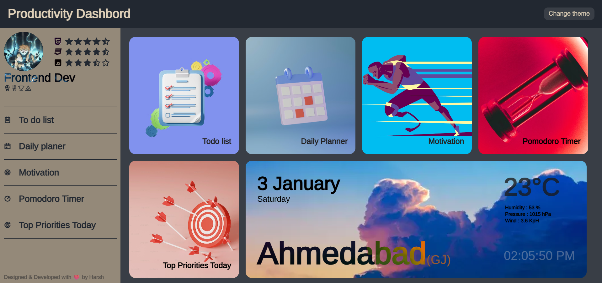
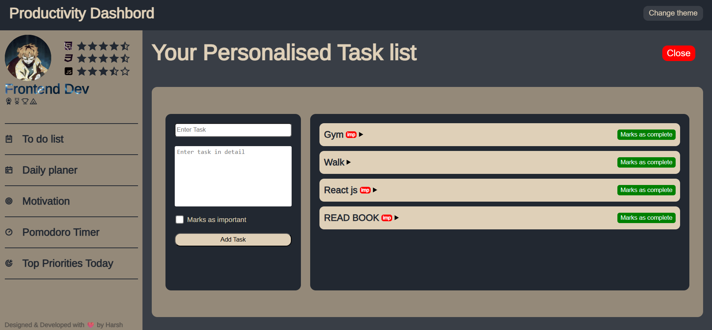

# 🚀 Productivity Dashboard

A **modern, all-in-one Productivity Dashboard** built using **HTML, SCSS & JavaScript**.  
This dashboard helps you manage tasks, plan your day, stay motivated, and track time efficiently — all in one place.




---

## 🏷️ Badges


---

## ✨ Features

- ✅ **To-Do List** – Add, mark important & complete tasks  
- 📅 **Daily Planner** – Plan your day efficiently  
- 🎯 **Top Priorities** – Focus on what matters most  
- 💡 **Motivation Section** – Stay inspired  
- ⏱️ **Pomodoro Timer** – Boost productivity with time blocks  
- 🌤️ **Live Weather Info** – City-based weather updates  
- 🎨 **Theme Switcher** – Dark / aesthetic UI  
- 📱 **Responsive Design** – Mobile friendly layout  

---

## 🛠️ Tech Stack

- **HTML5**
- **SCSS (SASS)**
- **JavaScript (ES6)**
- **OpenWeather API**

---

## 📂 Project Structure

```bash
Productivity-Dashboard/
│── index.html
│── style.scss
│── style.css
│── script.js
│── det.js
│── assets/
│   └── images/
│── README.md
